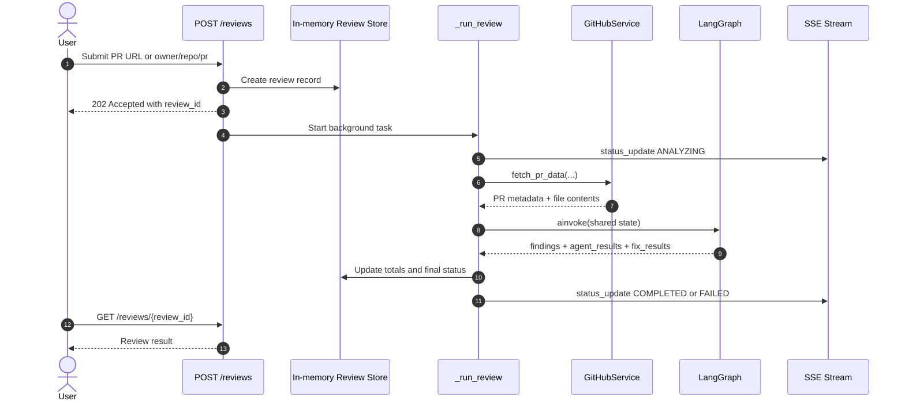
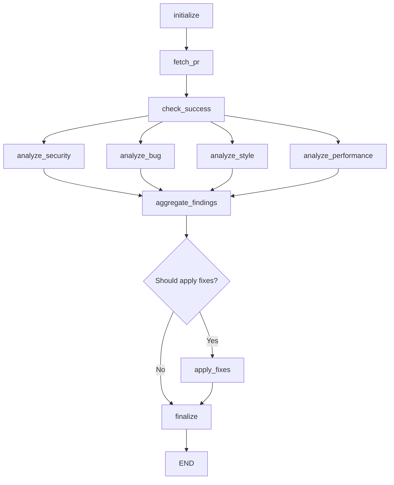
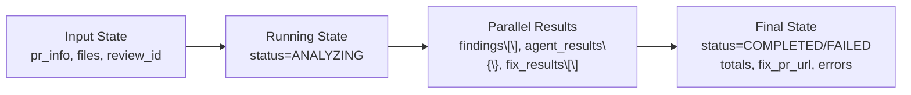

# Multi-Agent PR Review Architecture Overview

This document is the starting point for understanding the review flow in this repository. It connects the API entry point, the LangGraph orchestrator, and the detailed agent documentation so a new contributor can learn the system without reading every implementation file first.

## 1. Request-to-Result Lifecycle

The flow begins when a client calls the review API and ends when the review is stored with findings and optional fixes.

### What this means in code

- The API entry points live in [src/api/endpoints/review.py](../../src/api/endpoints/review.py).
- The review is created immediately and processed in the background.
- The background job publishes status updates through SSE so the UI can show progress.
- The orchestrator is invoked only after PR metadata and file data are available.

## 2. How the Graph Works

The review engine uses a LangGraph state graph. The graph is defined in [src/agents/orchestrator/graph.py](../../src/agents/orchestrator/graph.py) and the node implementations live in [src/agents/orchestrator/nodes.py](../../src/agents/orchestrator/nodes.py).

### Key design points

- The graph starts with initialization and PR fetch steps.
- It then fans out to four analysis agents: security, bug, style, and performance.
- All agent results converge at a single aggregation step.
- If findings exist, the pipeline moves into a fix phase; otherwise it finalizes directly.
- The shared state is defined in [src/agents/orchestrator/state.py](../../src/agents/orchestrator/state.py).

## 3. State Evolution Map

The graph passes one shared state object through every step. That state evolves from input data to analysis results and finally to completed review output.

### State fields

- `pr_info`: PR metadata such as owner, repo, PR number, and branch.
- `files`: the source files to analyze.
- `review_id`: used for SSE event publishing and correlation.
- `status`: tracks whether the review is fetching, analyzing, fixing, completed, or failed.
- `findings`: aggregated findings collected by the analysis agents.
- `agent_results`: per-agent result payloads.
- `fix_results`: results produced by the fix phase.
- `errors`: any errors encountered during the run.

## 4. Agent Deep Dives

The orchestrator fans out to specialized agents. Detailed walkthroughs already exist for each one:

- Security agent: [docs/architecture/agents/001-security-agent-current.md](agents/001-security-agent-current.md)
  - Uses retrieval-augmented prompting and LLM parsing to find security issues.
- Style agent: [docs/architecture/agents/002-style-agent.md](agents/002-style-agent.md)
  - Combines Ruff checks with LLM review for readability and maintainability.
- Performance agent: [docs/architecture/agents/003-performance-agent.md](agents/003-performance-agent.md)
  - Uses AST-based analyzers plus LLM review for performance hotspots.

## 5. Recommended Reading Order for New Contributors

1. Read this overview to understand the big picture.
2. Review [src/agents/orchestrator/graph.py](../../src/agents/orchestrator/graph.py) and [src/agents/orchestrator/nodes.py](../../src/agents/orchestrator/nodes.py) to understand routing logic.
3. Open one of the agent-specific documents for deeper implementation details.
4. Follow the request lifecycle in [src/api/endpoints/review.py](../../src/api/endpoints/review.py) to see how the API triggers the pipeline.

## 6. Mental Model

A useful way to think about the system is:

- The API creates a review request.
- The graph orchestrates the work.
- Each specialized agent adds findings to a shared state.
- The system deduplicates, decides whether fixes are appropriate, and then finalizes the result.
